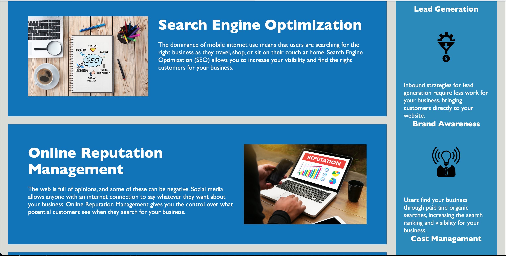
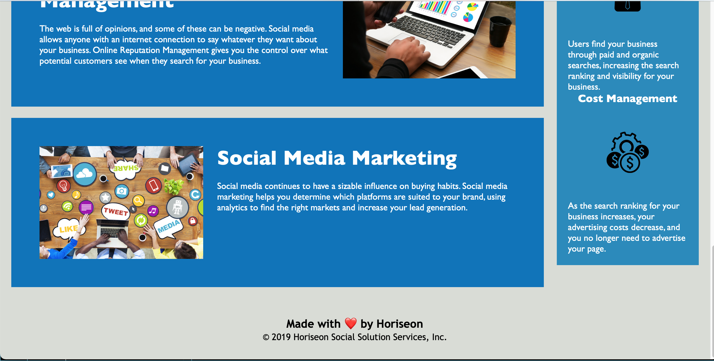

# Accessible-Horiseon-App

* As an exercise, I made the Horiseon webpage more accessible so that it will be able to show up higher in a Google search. Also, I organized the html and CSS in such a way that it would take up less space while also being easier to read. I didnt change antything that would be visual on the webpage but I was able to make the code better. Below, I will explain the steps I took to acheive this.

* First, I gave it a more descriptive title so that if it didn't load correctly, people would still be able to get a clear jist of the purpose of the page.

* Second, I added alt attributes to all of the images. This is important for when an image doesn't load. The consumer is still able to understand what the picture was about.

* Next, I added the semantic tags to categorize the code better and to give it meaning. This will help me as well as any other people looking at the project, understand what the section are for. 

* Next, I added to comments anywhere I felt neccessary. The comments I wrote helped me make a note of some things that I may have thought would be a good change but weren't. By making note of them, I could understand why I did them a certain way.

* Finally, I consolidated the CSS files to eliminate repetition. Nothing should be changed visually but the code is much easier to understand. 

* [Link to the website](https://reagintaylor.github.io/Accessible-Horiseon-App/) 

* This is how the website should look like.

